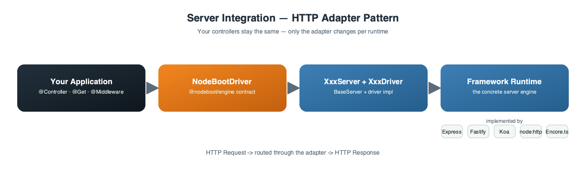
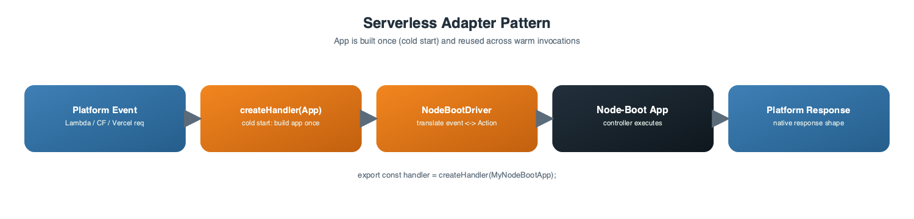
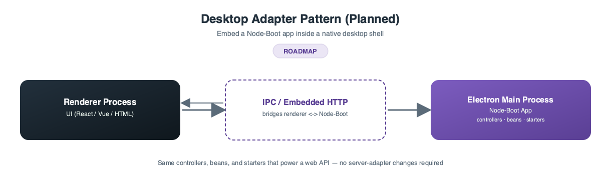
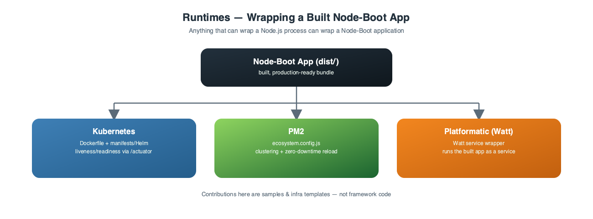
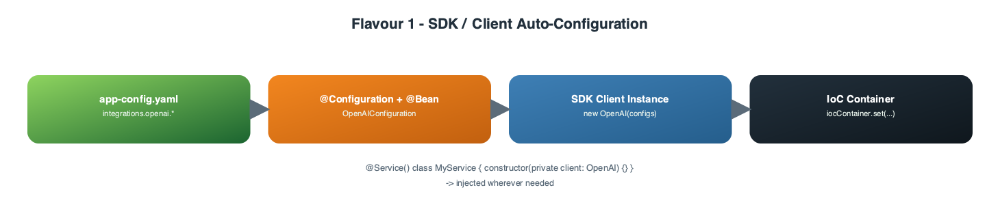
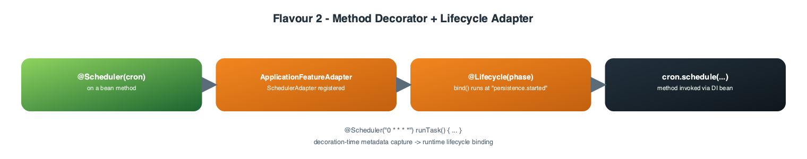
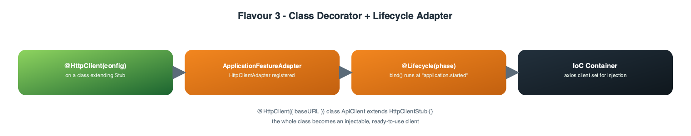
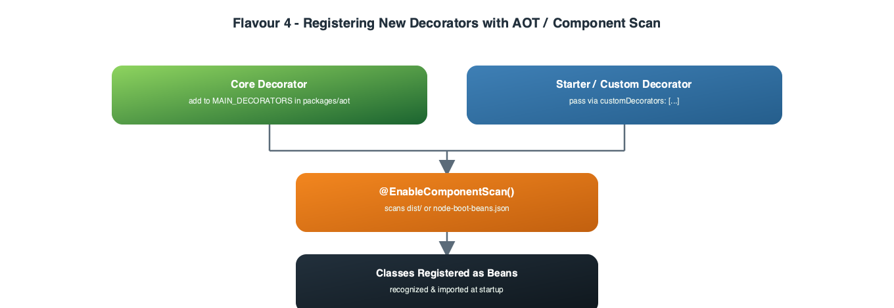
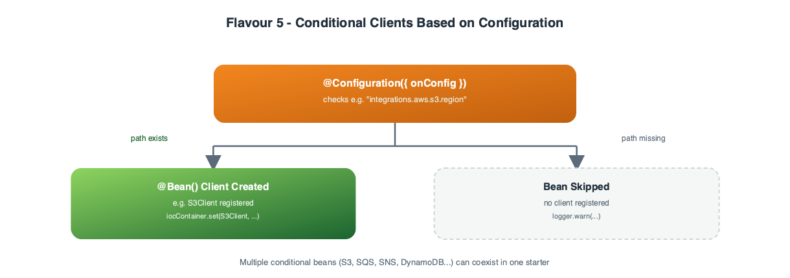
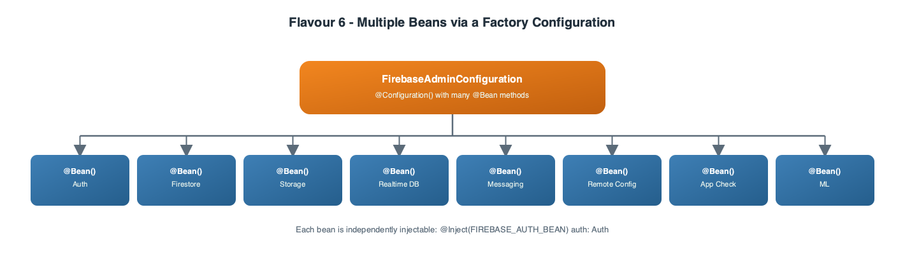

<a name="contributing-top"></a>

# 🤝 Contributing to Node-Boot

Thank you for considering a contribution to Node-Boot! This guide is the detailed companion to the
[**Integration Points**](README.md#-integration-points-how-you-can-contribute) section in the root README.
Read that section first for the high-level map, then come here for concrete, step-by-step guidance and code
examples for each contribution type.

## Table of Contents

-   [Getting Started](#getting-started)
-   [1. Server Integrations](#1-server-integrations)
    -   [1.1 HTTP Server Adapters](#11-http-server-adapters)
    -   [1.2 Serverless Adapters](#12-serverless-adapters)
    -   [1.3 Desktop Adapters](#13-desktop-adapters)
-   [2. Core Feature Contributions](#2-core-feature-contributions)
-   [3. Runtimes](#3-runtimes)
-   [4. Starter Packages](#4-starter-packages)
    -   [Flavour 1 — SDK/Client Auto-Configuration](#flavour-1--sdkclient-auto-configuration)
    -   [Flavour 2 — Method Decorators with a Lifecycle Adapter](#flavour-2--method-decorators-with-a-lifecycle-adapter)
    -   [Flavour 3 — Class Decorators with a Lifecycle Adapter](#flavour-3--class-decorators-with-a-lifecycle-adapter)
    -   [Flavour 4 — Registering New Decorators with AOT / Component Scan](#flavour-4--registering-new-decorators-with-aot--component-scan)
    -   [Flavour 5 — Conditional Clients Based on Configuration](#flavour-5--conditional-clients-based-on-configuration)
    -   [Flavour 6 — Multiple Beans via a Factory Configuration](#flavour-6--multiple-beans-via-a-factory-configuration)
-   [Application-Level Custom Decorators](#application-level-custom-decorators)
-   [Pull Request Checklist](#pull-request-checklist)

<p align="right">(<a href="#contributing-top">back to top</a>)</p>

## Getting Started

```sh
git clone https://github.com/nodejs-boot/node-boot.git
cd node-boot
pnpm install
pnpm dev     # builds & watches every package with Turborepo + Nodemon
```

Before opening a PR, always run:

```sh
pnpm lint-format   # lint + format check
pnpm tsc           # type-check every package
pnpm test          # run the full test suite
```

Commit messages must follow [Conventional Commits](https://www.conventionalcommits.org/).

<p align="right">(<a href="#contributing-top">back to top</a>)</p>

## 1. Server Integrations

Server integrations bind Node-Boot's decorator/engine model to a concrete runtime. Your application code
(controllers, beans, starters) never changes — only the adapter package does. All adapters implement the
`NodeBootDriver` contract from [`@nodeboot/engine`](packages/engine/README.md) and extend `BaseServer` from
[`@nodeboot/core`](packages/core/README.md).

### 1.1 HTTP Server Adapters



Location: `servers/*` — e.g. [`express-server`](servers/express-server), [`fastify-server`](servers/fastify-server),
[`koa-server`](servers/koa-server), [`http-server`](servers/http-server), [`encore-server`](servers/encore-server).

An HTTP server adapter has two responsibilities:

1. **`XxxServer`** — extends `BaseServer<TFramework, TRouter>`, creates the underlying framework app/router
   (e.g. `express()`, `Fastify()`, `new Koa()`), and exposes it to `NodeBoot.run(XxxServer)`.
2. **`XxxDriver`** — extends `NodeBootDriver<TFramework>` from `@nodeboot/engine` and implements:
    - `initialize()` — any framework-specific bootstrapping (body parsers, CORS, etc).
    - `registerMiddleware(middleware, options)` — wires a Node-Boot `@Middleware` into the framework's middleware chain.
    - `registerAction(actionMetadata, executeCallback)` — maps a Node-Boot controller action onto a framework route handler.
    - `registerRoutes()` — flushes all registered routes onto the framework router.
    - `getParamFromRequest(action, param)` — extracts `@Param`, `@Body`, `@QueryParam`, etc. from the framework's request object.
    - `handleError(...)` / `handleSuccess(...)` — map Node-Boot's response/error handling onto the framework's response object.

**Steps to add a new HTTP server adapter:**

1. Scaffold a new package under `servers/your-framework-server` (copy `servers/koa-server` as a starting template — it's a good, compact reference).
2. Implement `YourFrameworkServer extends BaseServer` and `YourFrameworkDriver extends NodeBootDriver`.
3. Support the full request/response parameter surface: path params, query params, headers, body, files, and the authorization/`@CurrentUser` hooks from [`@nodeboot/authorization`](packages/authorization/README.md).
4. Add a sample under `samples/sample-your-framework` that mirrors [`samples/sample-express`](samples/sample-express) so all starters (persistence, validation, OpenAPI, scheduling, ...) are exercised against your adapter.
5. Document the package with a README following the pattern used by existing adapters (overview, features, usage, configuration).

<p align="right">(<a href="#contributing-top">back to top</a>)</p>

### 1.2 Serverless Adapters



Location: `serverless/*` — e.g. [`lambda-server`](serverless/lambda-server), [`cloudflare-server`](serverless/cloudflare-server),
[`vercel-server`](serverless/vercel-server), [`netlify-server`](serverless/netlify-server),
[`google-cloud-functions-server`](serverless/google-cloud-functions-server).

Serverless adapters follow the same `NodeBootDriver` contract, but instead of binding to a long-lived HTTP server,
they typically:

1. Build the Node-Boot app **once** (outside the handler, so it's reused across warm invocations).
2. Expose a **platform-specific handler function** (e.g. AWS Lambda's `(event, context) => ...`, Cloudflare's
   `fetch(request, env, ctx)`, Vercel's `(req, res) => ...`) that translates the platform's request/response shape
   into the `NodeBootDriver` action lifecycle.
3. Take care of cold-start performance — avoid unnecessary work inside the handler body.

**Steps to add a new serverless adapter:**

1. Scaffold a new package under `serverless/your-platform-server` (use `serverless/lambda-server` or
   `serverless/vercel-server` as references — both are minimal, focused implementations).
2. Implement a driver that translates the platform's native request/response objects to/from Node-Boot's `Action`.
3. Export a handler factory, e.g. `export function createHandler(AppClass) { ... }`, so users can do:
    ```ts
    export const handler = createHandler(MyNodeBootApp);
    ```
4. Add a sample under `samples/sample-your-platform` deploying a minimal Node-Boot app to the target platform, including any required `platform.json`/config files for local emulation.

<p align="right">(<a href="#contributing-top">back to top</a>)</p>

### 1.3 Desktop Adapters



Location: _planned_ — no packages published yet. This is an open contribution opportunity.

The goal is to embed a Node-Boot application inside a native desktop app shell such as **Electron** or **Tauri**,
so the same controllers/services/starters that power a web API can run as the backend of a desktop application
(e.g. exposing an internal HTTP/IPC API to the renderer process).

If you want to pioneer this integration:

1. Open an issue describing the target framework (Electron first is recommended, since it's Node.js-native).
2. Propose whether the adapter binds Node-Boot to Electron's main process directly (IPC-based `NodeBootDriver`)
   or wraps one of the existing HTTP adapters (e.g. `http-server`) running embedded in the main process.
3. Follow the same `BaseServer` / `NodeBootDriver` contract used by the HTTP adapters above so the integration
   stays consistent with the rest of the framework.
4. Add a sample under `samples/sample-electron` demonstrating a minimal desktop app powered by Node-Boot.

<p align="right">(<a href="#contributing-top">back to top</a>)</p>

## 2. Core Feature Contributions

Core contributions touch the framework itself — `packages/core`, `packages/context`, `packages/di`,
`packages/engine`, `packages/config`, `packages/aot`, `packages/authorization`, `packages/error`, or
`packages/tools` — rather than an integration point.

This includes:

-   Adding or improving a **core decorator** (e.g. new controller/param/config decorators).
-   Extending the **application lifecycle** (`@Lifecycle`, `ApplicationFeatureAdapter`) with new phases or hooks.
-   Improving the **DI container integration**, **AOT scanning**, or **configuration loading**.
-   **Reporting and fixing bugs** anywhere in the framework — this is one of the most valuable and accessible ways
    to contribute, even without deep framework knowledge.

**Steps:**

1. Open an issue first for anything beyond a small bug fix, describing the motivation and proposed API.
2. Add/update unit tests in the affected package (`packages/*/test` or co-located `*.test.ts` files).
3. Update the package's own README with the new decorator/API and a usage example.
4. Run `pnpm tsc && pnpm test` for the whole workspace — core changes often ripple into starters and samples.

<p align="right">(<a href="#contributing-top">back to top</a>)</p>

## 3. Runtimes



"Runtimes" contributions are about **how and where** a Node-Boot application is deployed and operated once
it's built — they don't change framework code at all. Anything that can wrap/manage a Node.js process can wrap
a Node-Boot application. Contributions here typically live as **documentation, examples, and infra templates**
rather than published npm packages, and are a great entry point for infra/DevOps-minded contributors.

Examples of welcome contributions:

-   **Kubernetes** — production-ready `Dockerfile`s, Helm charts or plain manifests, health-check wiring using the
    [`@nodeboot/starter-actuator`](starters/actuator/README.md) `/actuator/health` endpoint for liveness/readiness probes, and a reference infra project.
-   **Platformatic (Watt)** — a wrapper/guide showing how to run a Node-Boot app as a Watt service.
-   **PM2** — an ecosystem file (`ecosystem.config.js`) and guide for running a Node-Boot app as a managed PM2 process (clustering, zero-downtime reload, log management).
-   Any other process manager, container runtime, or PaaS (Docker Compose, Nomad, Fly.io, Render, etc).

**Steps:**

1. Add a new folder under `samples/` (e.g. `samples/sample-kubernetes`, `samples/sample-pm2`) with a minimal
   Node-Boot app plus the runtime-specific configuration (Dockerfile, k8s manifests, `ecosystem.config.js`, etc).
2. Include a README explaining prerequisites, how to build, and how to run/deploy locally.
3. Where relevant, wire up `@nodeboot/starter-actuator` health/metrics endpoints so the sample demonstrates
   production-grade operational readiness (liveness/readiness probes, Prometheus scraping, graceful shutdown).

<p align="right">(<a href="#contributing-top">back to top</a>)</p>

## 4. Starter Packages

Starters live under `starters/*` and are how third-party SDKs, clients, and platforms get integrated into
Node-Boot through **auto-configuration** and **AOT scanning**. There are several distinct "flavours" of starter,
depending on what you're integrating. Pick the flavour(s) that match your integration — most starters combine
more than one.

### Flavour 1 — SDK/Client Auto-Configuration



The simplest flavour: wrap a third-party SDK/client so it's configured from `app-config.yaml` and registered in
the IoC container, ready to be `@Inject()`-ed into services. **Reference:** [`@nodeboot/starter-openai`](starters/openai/README.md).

```ts
// config/OpenAIConfiguration.ts
import {Bean, Configuration} from "@nodeboot/core";
import {BeansContext} from "@nodeboot/context";
import OpenAI from "openai";

@Configuration()
export class OpenAIConfiguration {
    @Bean()
    public openAiConfig({logger, config, iocContainer}: BeansContext): void {
        const openAiConfigs = config.getOptional<{baseURL: string; apiKey: string}>("integrations.openai");

        if (openAiConfigs) {
            iocContainer.set(OpenAI, new OpenAI(openAiConfigs));
            logger.info("OpenAI client successfully configured");
        } else {
            logger.warn('No "integrations.openai" config found in app-config.yaml');
        }
    }
}
```

```ts
// decorator/EnableOpenAI.ts
import {OpenAIConfiguration} from "../config";

export const EnableOpenAI = (): ClassDecorator => {
    return () => {
        new OpenAIConfiguration();
    };
};
```

Users then enable it with a single decorator on their application class:

```ts
@EnableOpenAI()
@EnableDI(Container)
@NodeBootApplication()
export class MyApp implements NodeBootApp {
    start() {
        return NodeBoot.run(ExpressServer);
    }
}
```

<p align="right">(<a href="#contributing-top">back to top</a>)</p>

### Flavour 2 — Method Decorators with a Lifecycle Adapter



Starters that introduce a **method decorator** (like `@Scheduler(...)`) need a runtime adapter tied to a specific
application lifecycle phase, since the decorated method must be wired up once the application (and its
dependencies) are ready. **Reference:** [`@nodeboot/starter-scheduler`](starters/scheduler/README.md).

```ts
// decorator/Scheduler.ts — collects metadata at decoration time
import {ApplicationContext} from "@nodeboot/context";
import {SchedulerAdapter} from "../adapter";

export function Scheduler(cronExpression: string): MethodDecorator {
    return function (target: any, propertyKey: string | symbol, descriptor: PropertyDescriptor) {
        const schedulerAdapter = new SchedulerAdapter({
            target,
            cronExpression,
            cronFunction: descriptor.value,
        });
        ApplicationContext.get().applicationFeatureAdapters.push(schedulerAdapter);
    };
}
```

```ts
// adapter/SchedulerAdapter.ts — does the real work once the app lifecycle reaches this phase
import {ApplicationFeatureAdapter, ApplicationFeatureContext, Lifecycle} from "@nodeboot/context";
import cron from "node-cron";

@Lifecycle("persistence.started")
export class SchedulerAdapter implements ApplicationFeatureAdapter {
    constructor(private readonly options: {target: any; cronFunction: Function; cronExpression: string}) {}

    bind({logger, iocContainer}: ApplicationFeatureContext): void {
        const {target, cronFunction, cronExpression} = this.options;
        const componentBean = iocContainer.get(target.constructor);

        cron.schedule(cronExpression, () => cronFunction.apply(componentBean));
        logger.info(`Registered scheduler ${target.constructor.name}::${cronFunction.name}`);
    }
}
```

Pair the method decorator with an `@Enable...()` feature-flag decorator (see [`EnableScheduling`](starters/scheduler/src/decorator/EnableScheduling.ts))
so the feature can be toggled on/off, and check `allowedProfiles(target)` in your adapter's `bind()` method to
respect `@Profile(...)` filtering.

Available `@Lifecycle(...)` phases (from [`@nodeboot/context`](packages/context/README.md)):

| Phase                     | Runs                                                   |
| ------------------------- | ------------------------------------------------------ |
| `application.initialized` | After core application setup but before services start |
| `persistence.started`     | After the persistence/data layer is initialized        |
| `application.started`     | After all services are up and the application is ready |
| `application.stopped`     | During graceful shutdown                               |

<p align="right">(<a href="#contributing-top">back to top</a>)</p>

### Flavour 3 — Class Decorators with a Lifecycle Adapter



Starters that introduce a **class decorator** (like `@HttpClient(...)`) follow the same lifecycle-adapter pattern
as Flavour 2, but register a whole class instance (typically a client/service) rather than a single method.
**Reference:** [`@nodeboot/starter-http`](starters/http/README.md).

```ts
// decorator/HttpClient.ts
import {ApplicationContext} from "@nodeboot/context";
import {HttpClientAdapter} from "../adapter";

export function HttpClient(config: HttpClientConfig | string, plugins?: PluginConfigs): ClassDecorator {
    return function (target: any) {
        const adapter = new HttpClientAdapter(target, config, plugins);
        ApplicationContext.get().applicationFeatureAdapters.push(adapter);
    };
}
```

```ts
// adapter/HttpClientAdapter.ts
import {ApplicationFeatureAdapter, ApplicationFeatureContext, Lifecycle} from "@nodeboot/context";
import axios from "axios";

@Lifecycle("application.started")
export class HttpClientAdapter implements ApplicationFeatureAdapter {
    constructor(
        private readonly targetClass: new (...args: any[]) => any,
        private clientConfig: HttpClientConfig | string,
    ) {}

    bind({logger, iocContainer, config}: ApplicationFeatureContext): void {
        const resolvedConfig = this.resolveConfig(config);
        const client = axios.create(resolvedConfig);
        iocContainer.set(this.targetClass, client);
        logger.info(`Registered HTTP client ${this.targetClass.name}`);
    }
    // ...
}
```

Usage — the decorated class becomes an injectable client:

```ts
@HttpClient({baseURL: "https://api.example.com"})
export class ExampleApiClient extends HttpClientStub {}

@Service()
class MyService {
    constructor(private readonly client: ExampleApiClient) {}
}
```

<p align="right">(<a href="#contributing-top">back to top</a>)</p>

### Flavour 4 — Registering New Decorators with AOT / Component Scan



Any new **framework decorator** you introduce (except validation decorators, which are handled by
`class-validator`) must be recognized by [`@nodeboot/aot`](packages/aot/README.md) so it gets discovered and
pre-processed when the application is decorated with `@EnableComponentScan()`.

-   If the decorator is part of the **core framework**, add its name to `MAIN_DECORATORS` in
    `packages/aot/src/decorators.main.js`.
-   If the decorator belongs to a **starter package** you're contributing, you don't need to touch `@nodeboot/aot`
    directly — instead, document that consumers should register it as a **custom decorator**:

```ts
@EnableComponentScan({
    customDecorators: [YourNewDecorator],
})
@NodeBootApplication()
export class MyApp implements NodeBootApp {
    start() {
        return NodeBoot.run(FastifyServer);
    }
}
```

This tells the AOT scanner to also treat classes annotated with `@YourNewDecorator` as beans to import during
startup (either via the prebuilt `node-boot-beans.json` manifest or live scanning in development).

<p align="right">(<a href="#contributing-top">back to top</a>)</p>

## Application-Level Custom Decorators

You don't have to contribute to the framework to create your own decorators — application owners can define
project-specific decorators following the same Node-Boot patterns and register them the same way:

```ts
/**
 * **ScheduledProvider Decorator**
 *
 * Registers a **scheduled provider**, which runs based on a cron schedule.
 * It integrates with **NodeBoot** by adding the provider to the application feature adapters.
 */
export function ScheduledProvider<T extends ProviderClass>(options: ScheduledProviderOptions) {
    return (providerClass: T) => {
        ApplicationContext.get().applicationFeatureAdapters.push(
            new ProviderAdapter(providerClass, ProviderType.SCHEDULED, options),
        );
        Service()(providerClass); // Mark the class as a NodeBoot service
    };
}
```

Then register it manually on your application class:

```ts
@EnableComponentScan({
    customDecorators: [ScheduledProvider],
})
@NodeBootApplication()
export class ProvidersRunnerApplication implements NodeBootApp {
    start(injectedConfig?: JsonObject): Promise<NodeBootAppView> {
        return NodeBoot.run(FastifyServer, injectedConfig);
    }
}
```

And use it on a provider class:

```ts
@ScheduledProvider({
    slug: "catalog-s3-exporter",
    name: "Catalog S3 Exporter Provider",
    collection: "catalog-export-facts",
    description: "Exports catalog services and systems to S3 for downstream Datadog Workflow consumption",
    cron: "55 * * * 1-5", // Every hour at minute 55, Mon–Fri — runs BEFORE Datadog Workflows at minute 0
})
export class CatalogExporterProvider extends BaseProvider {
    // Inject beans from DI container (e.g., S3Client) using the @Inject decorator
    @Inject("S3Client")
    private readonly s3Client: S3Client;

    async run(): Promise<void> {
        this.logger.info("Running CatalogExporterProvider...");
        // ...implementation...
    }
}
```

This same pattern (decorator + `ApplicationFeatureAdapter` + `@Lifecycle(...)`) is exactly what Flavours 2 and 3
above use — so once you're comfortable writing a custom application-level decorator, you already know how to
build a starter package decorator too.

<p align="right">(<a href="#contributing-top">back to top</a>)</p>

### Flavour 5 — Conditional Clients Based on Configuration



Some starters register their client(s) **only if** the relevant configuration is present, using `@Configuration`'s
`onConfig` option. This avoids failing or noisy startup logs when a given integration isn't configured for the
current environment. **Reference:** [`@nodeboot/starter-aws`](starters/aws/README.md) (`S3ClientConfiguration`).

```ts
@Configuration({onConfig: "integrations.aws.s3.region"})
export class S3ClientConfiguration {
    @Bean()
    public async s3Client({logger, config, iocContainer}: BeansContext) {
        const {S3Client} = await import("@aws-sdk/client-s3");
        const region = config.getString("integrations.aws.s3.region");
        const credentials = config.getOptional<AwsCredentialIdentity>("integrations.aws.credentials");

        iocContainer.set(S3Client, new S3Client({region, credentials}));
    }
}
```

The `@Bean` method is only invoked when `config.has("integrations.aws.s3.region")` is `true`, so multiple
conditional clients (S3, SQS, SNS, DynamoDB, Secrets Manager, ...) can live side-by-side in the same starter and
only the ones actually configured get initialized — as seen across `starters/aws/src/config/*`.

<p align="right">(<a href="#contributing-top">back to top</a>)</p>

### Flavour 6 — Multiple Beans via a Factory Configuration



Some starters expose **several related clients/services** from a single `@Configuration` class, following a beans
factory approach — one `@Bean` per capability, each independently injectable. **Reference:**
[`@nodeboot/starter-firebase`](starters/firebase/README.md) (`FirebaseAdminConfiguration`).

```ts
@Configuration()
export class FirebaseAdminConfiguration {
    @Bean()
    public initFirebase({logger, config}: BeansContext) {
        const serviceAccountConfig = config.get<FirebaseIntegrationConfig>("integrations.firebase");
        admin.initializeApp({credential: admin.credential.cert(serviceAccountConfig.serviceAccount)});
    }

    @Bean(FIREBASE_AUTH_BEAN)
    public firebaseAuth(): auth.Auth {
        return admin.auth();
    }

    @Bean(FIREBASE_FIRESTORE_BEAN)
    public firestoreClient(): firestore.Firestore {
        return admin.firestore();
    }

    @Bean(FIREBASE_STORAGE_BEAN)
    public firebaseStorage(): storage.Storage {
        return admin.storage();
    }

    // ...messaging, remoteConfig, appCheck, machineLearning, etc.
}
```

Each named bean (`FIREBASE_AUTH_BEAN`, `FIREBASE_FIRESTORE_BEAN`, ...) can then be injected independently:

```ts
@Service()
class UserService {
    constructor(@Inject(FIREBASE_AUTH_BEAN) private readonly auth: auth.Auth) {}
}
```

Use this flavour when your integration's SDK exposes multiple independent sub-services that consumers may want
to inject selectively, rather than a single monolithic client.

<p align="right">(<a href="#contributing-top">back to top</a>)</p>

## Pull Request Checklist

-   [ ] Change is scoped to a single concern (one adapter, one starter, one core fix).
-   [ ] `pnpm lint-format`, `pnpm tsc`, and `pnpm test` pass locally.
-   [ ] New/changed decorators are documented in the package README with a usage example.
-   [ ] New framework decorators are registered per [Flavour 4](#flavour-4--registering-new-decorators-with-aot--component-scan) if applicable.
-   [ ] A sample app was added/updated to demonstrate the change, where relevant.
-   [ ] Commit messages follow [Conventional Commits](https://www.conventionalcommits.org/).
-   [ ] PR description explains the motivation and links any related issue.

Thank you for helping grow Node-Boot! 🚀

<p align="right">(<a href="#contributing-top">back to top</a>)</p>
