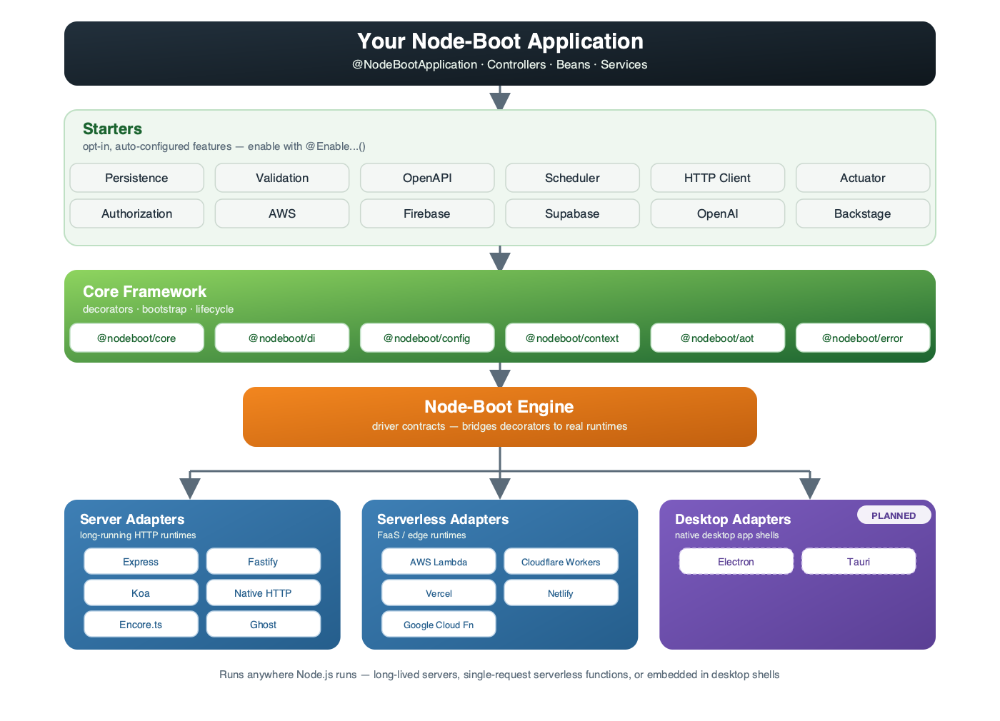

<a name="readme-top"></a>

<br />
<div align="center">
  </img>
  <h1>Node-Boot</h1>
  <p><b>Spring Boot–style developer experience for Node.js.</b><br/>
  Decorators, dependency injection, auto-configuration, and a pluggable server engine — so you can bootstrap production-grade services with minimum fuss.</p>

  <p>
    <a href="https://nodeboot.io" target="_blank"><b>nodeboot.io</b></a> ·
    <a href="https://nodeboot-1.gitbook.io/node-boot-framework" target="_blank">Documentation</a> ·
    <a href="#-build-with-agentic-ai">Build with Agentic AI</a> ·
    <a href="#-quick-start">Quick Start</a> ·
    <a href="#-samples">Samples</a> ·
    <a href="#-contributing">Contributing</a>
  </p>

  <p>
    
    
    
    
  </p>
</div>

> 🚧 **Active development.** Docs are growing fast — the fastest way to learn Node-Boot today is through the [sample projects](#-samples) below, backed by the package READMEs linked throughout this document.

## Why Node-Boot?

If you've used **Spring Boot**, Node-Boot will feel like home. If you haven't, here's the pitch:

-   🧩 **Decorator-driven** — define controllers, beans, configuration, and cross-cutting concerns declaratively (`@Controller`, `@Get`, `@Configuration`, `@Bean`, `@EnableDI`, ...).
-   ⚙️ **Auto-configuration** — enable a feature with a single `@Enable...()` decorator on your app entry point; Node-Boot wires the rest.
-   🔌 **Server-agnostic** — the same application code runs on Express, Fastify, Koa, Hono, native HTTP, or "ghost" (no HTTP) mode — just swap the server adapter.
-   ☁️ **Serverless-ready** — deploy the exact same app to AWS Lambda, Cloudflare Workers, Vercel, Netlify, or Google Cloud Functions.
-   🧠 **Batteries included, opt-in** — persistence (TypeORM), validation, scheduling, OpenAPI/Swagger, authorization, HTTP clients, actuator/observability, and more, each as an independent starter you enable only when you need it.
-   🛡️ **Strict TypeScript** end to end, with fast builds (Turborepo + SWC) and a monorepo you can actually navigate.

```ts
@EnableDI(Container)
@EnableOpenApi()
@EnableSwaggerUI()
@EnableActuator()
@EnableRepositories()
@EnableScheduling()
@EnableHttpClients()
@EnableValidations()
@EnableComponentScan()
@NodeBootApplication()
export class GreetingsApp implements NodeBootApp {
    start(): Promise<NodeBootAppView> {
        return NodeBoot.run(HttpServer);
    }
}
```

```ts
@Controller("/hello")
class HelloController {
    @Get("/:name")
    sayHello(@Param("name") name: string) {
        return {message: `Hello, ${name}!`};
    }
}
```

That's a running, typed, auto-wired HTTP service. Add `@EnableOpenApi()`, `@EnableRepositories()`, `@EnableScheduling()`, or any other starter to layer on more capability without touching your controllers.

<p align="right">(<a href="#readme-top">back to top</a>)</p>

## 📊 Benchmarking

Node-Boot ships with a dedicated [`benchmarking/`](./benchmarking) suite comparing every HTTP server adapter (Express, Fastify, Koa, native `http`) against its equivalent raw-framework baseline, backed by a real PostgreSQL database.

See the [Req/s overview](./benchmarking/results/README.md#overall-summary) for the at-a-glance chart, or the full [benchmark report](./benchmarking/results/README.md) for per-endpoint throughput/latency numbers and overhead analysis. Want to run it yourself? Head to [`benchmarking/`](./benchmarking) for setup and usage instructions.


<p align="right">(<a href="#readme-top">back to top</a>)</p>

## 📖 How to Use

Node-Boot applications are built by composing decorators from `@nodeboot/core` (controllers, routing, DI, configuration, middlewares, models, ...) with `@Enable...()` decorators from the starters you opt into. Decorate your entry-point class, define `@Controller` classes with `@Get`/`@Post`/etc. actions, inject request data with parameter decorators like `@Param`/`@Body`/`@QueryParam`, and register cross-cutting concerns with `@Middleware`, `@ErrorHandler`, or `@Interceptor`.

For a full breakdown of every decorator in the project — core framework, DI, configuration, authorization, and every starter (persistence, OpenAPI, scheduling, HTTP clients, validation, actuator, AWS, and more) — its purpose and a usage example, see the **[Usage Guide](./USAGE_GUIDE.md)**.

<p align="right">(<a href="#readme-top">back to top</a>)</p>

## 🤖 Build with Agentic AI

Node-Boot ships an [Agent Skills](https://www.anthropic.com/engineering/equipping-agents-for-the-real-world-with-agent-skills)-compatible
skill family under [`.agents/skills/`](./.agents/skills/) that teaches coding agents (GitHub
Copilot CLI, Claude Code, Cursor, and 70+ others) how to scaffold, extend, and operate Node-Boot
apps — decorators, starters, server/serverless adapters, runtimes, and integration testing — without
you having to paste docs into every prompt.

**Install the skills into your own project** with the [`skills` CLI](https://github.com/vercel-labs/skills)
from [skills.sh](https://www.skills.sh/):

```bash
# Install every Node-Boot skill into the current project (targeting GitHub Copilot CLI)
npx skills add nodejs-boot/node-boot --skill '*' -a copilot-cli

# Or install just what you need, e.g. the core skill + the starters router
npx skills add nodejs-boot/node-boot --skill nodeboot-core --skill nodeboot-starters -a copilot-cli

# List every available skill without installing
npx skills add nodejs-boot/node-boot --list
```

Then just ask your agent to build something — e.g. _"scaffold a new Node-Boot app on Fastify with
Postgres persistence and OpenAPI docs"_ — and it will pull in the relevant skills automatically.
See the full [skills inventory and publishing guide](./.agents/skills/README.md) for every skill
available and how the family is organized.

Use a skill one-off without installing it (generates a prompt, or drives an agent interactively):

```bash
npx skills use nodejs-boot/node-boot@nodeboot-core | copilot
npx skills use nodejs-boot/node-boot --skill nodeboot-core --agent copilot-cli
```

## 🗺️ Architecture



Node-Boot is a **pnpm + Turborepo monorepo** organized into five layers:

| Layer                            | Location                                         | What it does                                                                                                       |
| -------------------------------- | ------------------------------------------------ | ------------------------------------------------------------------------------------------------------------------ |
| **Core Framework**               | [`packages/*`](#-core-framework-packages)        | Bootstrap, DI, config, context, decorators, engine/driver contracts, errors, AOT tooling                           |
| **Server Adapters**              | [`servers/*`](#-server-adapters)                 | Bind Node-Boot to a concrete HTTP runtime (Express, Fastify, Koa, Hono, native HTTP, Encore.ts, ghost)             |
| **Serverless Adapters**          | [`serverless/*`](#%EF%B8%8F-serverless-adapters) | Bind Node-Boot to FaaS platforms (Lambda, Cloudflare Workers, Vercel, Netlify, Google Cloud Functions)             |
| **Desktop Adapters** _(planned)_ | —                                                | Embed Node-Boot in native desktop app shells (Electron, Tauri) — on the roadmap, not yet published                 |
| **Starters**                     | [`starters/*`](#-starters-opt-in-features)       | Opt-in, auto-configured features (persistence, validation, scheduling, OpenAPI, auth, actuator, HTTP clients, ...) |
| **Samples**                      | [`samples/*`](#-samples)                         | Full, runnable reference applications combining the pieces above                                                   |

<p align="right">(<a href="#readme-top">back to top</a>)</p>

## 📦 Core Framework Packages

| Package                                                       | Description                                                                                                                             |
| ------------------------------------------------------------- | --------------------------------------------------------------------------------------------------------------------------------------- |
| [`@nodeboot/core`](packages/core/README.md)                   | The heart of Node-Boot — `@NodeBootApplication()`, `NodeBoot.run(...)`, `BaseServer`, controller/config decorators, lifecycle & logging |
| [`@nodeboot/context`](packages/context/README.md)             | Shared runtime contracts — `ApplicationContext`, IoC abstractions, metadata models, middleware/interceptor contracts                    |
| [`@nodeboot/di`](packages/di/README.md)                       | Dependency injection integration (`@EnableDI`) for controllers, services, listeners, and resolvers                                      |
| [`@nodeboot/config`](packages/config/README.md)               | Typed configuration via `ConfigService` and `@ConfigurationProperties()`, backed by `app-config.yaml`                                   |
| [`@nodeboot/engine`](packages/engine/README.md)               | The driver engine that connects Node-Boot's decorator model to concrete server adapters                                                 |
| [`@nodeboot/authorization`](packages/authorization/README.md) | `@EnableAuthorization`, `@Authorized`, and `@CurrentUser` for pluggable authz/authn hooks                                               |
| [`@nodeboot/aot`](packages/aot/README.md)                     | Ahead-of-time compilation — generates beans and OpenAPI schemas at build time                                                           |
| [`@nodeboot/error`](packages/error/README.md)                 | Shared base errors/exceptions used across the framework                                                                                 |
| [`@nodeboot/tools`](packages/tools/README.md)                 | CI/CD and automation helpers used across the monorepo                                                                                   |

<p align="right">(<a href="#readme-top">back to top</a>)</p>

## 🖥️ Server Adapters

Pick the HTTP runtime that fits your project — your application code stays the same.

| Package                                                        | Description                                                           |
| -------------------------------------------------------------- | --------------------------------------------------------------------- |
| [`@nodeboot/express-server`](servers/express-server/README.md) | Express adapter — the most battle-tested option                       |
| [`@nodeboot/fastify-server`](servers/fastify-server/README.md) | Fastify adapter for high-throughput services                          |
| [`@nodeboot/koa-server`](servers/koa-server/README.md)         | Koa adapter with middleware/session/cookie support                    |
| [`@nodeboot/hono-server`](servers/hono-server/README.md)       | Hono adapter — Web Standards (Fetch API) based, ultrafast             |
| [`@nodeboot/http-server`](servers/http-server/README.md)       | Native Node.js `http` adapter — no framework dependency               |
| [`@nodeboot/encore-server`](servers/encore-server/README.md)   | Encore.ts adapter for Encore-based backends                           |
| [`@nodeboot/ghost-server`](servers/ghost-server/README.md)     | No-HTTP "ghost" runtime for pure IoC apps, background jobs, and tests |

<p align="right">(<a href="#readme-top">back to top</a>)</p>

## ☁️ Serverless Adapters

Deploy Node-Boot applications directly to your favorite FaaS platform.

| Package                                                                                         | Description                                 |
| ----------------------------------------------------------------------------------------------- | ------------------------------------------- |
| [`@nodeboot/lambda-server`](serverless/lambda-server/README.md)                                 | AWS Lambda handler adapter                  |
| [`@nodeboot/cloudflare-server`](serverless/cloudflare-server/README.md)                         | Cloudflare Workers fetch-handler adapter    |
| [`@nodeboot/vercel-server`](serverless/vercel-server/README.md)                                 | Vercel serverless function adapter          |
| [`@nodeboot/netlify-server`](serverless/netlify-server/README.md)                               | Netlify Functions adapter                   |
| [`@nodeboot/google-cloud-functions-server`](serverless/google-cloud-functions-server/README.md) | Google Cloud Functions HTTP handler adapter |

<p align="right">(<a href="#readme-top">back to top</a>)</p>

## 🧰 Starters (opt-in features)

Enable exactly what you need with a single decorator on your `@NodeBootApplication()` class.

| Package                                                           | Description                                                                     |
| ----------------------------------------------------------------- | ------------------------------------------------------------------------------- |
| [`@nodeboot/starter-persistence`](starters/persistence/README.md) | TypeORM-backed repositories, migrations, transactions, paging, entity listeners |
| [`@nodeboot/starter-validation`](starters/validation/README.md)   | Request validation using `class-validator` DTOs                                 |
| [`@nodeboot/starter-openapi`](starters/openapi/README.md)         | Auto-generated OpenAPI specs (+ Swagger UI) from your controllers               |
| [`@nodeboot/starter-scheduler`](starters/scheduler/README.md)     | Cron-style scheduled jobs via `@Scheduler(...)`                                 |
| [`@nodeboot/starter-http`](starters/http/README.md)               | Typed outbound HTTP clients via `@HttpClient(...)`                              |
| [`@nodeboot/starter-actuator`](starters/actuator/README.md)       | Health checks, Prometheus metrics, build info, and introspection endpoints      |
| [`@nodeboot/starter-aws`](starters/aws/README.md)                 | Auto-configuration for AWS services                                             |
| [`@nodeboot/starter-firebase`](starters/firebase/README.md)       | Auto-configuration for Firebase                                                 |
| [`@nodeboot/starter-supabase`](starters/supabase/README.md)       | Auto-configuration for Supabase                                                 |
| [`@nodeboot/starter-openai`](starters/openai/README.md)           | Auto-configuration for OpenAI                                                   |
| [`@nodeboot/starter-backstage`](starters/backstage/README.md)     | Backstage Catalog integration                                                   |

<p align="right">(<a href="#readme-top">back to top</a>)</p>

## 🚀 Samples

Full reference applications — the fastest way to see everything working together:

| Sample                                                                 | Highlights                                                                                                    |
| ---------------------------------------------------------------------- | ------------------------------------------------------------------------------------------------------------- |
| [sample-express](samples/sample-express)                               | Flagship sample — persistence, OpenAPI/Swagger, validation, authorization, scheduling, HTTP clients, actuator |
| [sample-fastify](samples/sample-fastify)                               | Same feature set, running on Fastify                                                                          |
| [sample-koa](samples/sample-koa)                                       | Same feature set, running on Koa                                                                              |
| [sample-hono](samples/sample-hono)                                     | Same feature set, running on Hono                                                                             |
| [sample-native-http](samples/sample-native-http)                       | Running on the native Node.js `http` server                                                                   |
| [sample-ghost-server](samples/sample-ghost-server)                     | Pure IoC application without an HTTP layer                                                                    |
| [sample-encore](samples/sample-encore)                                 | Running on Encore.ts                                                                                          |
| [sample-express-mongodb](samples/sample-express-mongodb)               | Express + MongoDB persistence                                                                                 |
| [sample-native-http-supabase](samples/sample-native-http-supabase)     | Native HTTP + Supabase starter                                                                                |
| [sample-lambda](samples/sample-lambda)                                 | Deploying to AWS Lambda                                                                                       |
| [sample-cloudflare](samples/sample-cloudflare)                         | Deploying to Cloudflare Workers                                                                               |
| [sample-vercel](samples/sample-vercel)                                 | Deploying to Vercel                                                                                           |
| [sample-netlify](samples/sample-netlify)                               | Deploying to Netlify Functions                                                                                |
| [sample-google-cloud-functions](samples/sample-google-cloud-functions) | Deploying to Google Cloud Functions                                                                           |

<p align="right">(<a href="#readme-top">back to top</a>)</p>

## ⚡ Quick Start

### Prerequisites

-   **Node.js 18+**
-   **pnpm** — install via [pnpm.io/installation](https://pnpm.io/installation) or `brew install pnpm` on macOS

### Clone & explore the monorepo

```sh
git clone https://github.com/nodejs-boot/node-boot.git
cd node-boot
pnpm install
```

### Run everything in dev/watch mode

```sh
pnpm dev
```

Turborepo + Nodemon build and watch every package in parallel.

### Try a sample app

```sh
cd samples/sample-express
pnpm install
pnpm dev
```

### Start your own app

The quickest path is to copy the sample closest to your target server (Express, Fastify, Koa, Hono, native HTTP, or a serverless adapter) and trim it down, or install the packages directly:

```sh
pnpm add @nodeboot/core @nodeboot/di @nodeboot/express-server
```

Then follow the [Documentation](https://nodeboot-1.gitbook.io/node-boot-framework) and the [`@nodeboot/core`](packages/core/README.md) README to wire up your first `@NodeBootApplication()`.

<p align="right">(<a href="#readme-top">back to top</a>)</p>

## 🧪 Useful Monorepo Commands

| Command                | Description                                          |
| ---------------------- | ---------------------------------------------------- |
| `pnpm install`         | Install all workspace dependencies                   |
| `pnpm dev`             | Run all packages in watch mode (Turborepo + Nodemon) |
| `pnpm build`           | Build all packages                                   |
| `pnpm test`            | Run the full test suite in parallel                  |
| `pnpm tsc`             | Type-check every package in parallel                 |
| `pnpm lint-format`     | Lint and check formatting across the repo            |
| `pnpm lint-format:fix` | Auto-fix lint and formatting issues                  |

<p align="right">(<a href="#readme-top">back to top</a>)</p>

## 🛠️ Built With

-   [PNPM](https://pnpm.io/) — fast, disk-efficient package management with native workspace support
-   [Turborepo](https://turbo.build/repo) — high-performance monorepo build system with caching
-   [TypeScript](https://www.typescriptlang.org/) — strict, type-safe codebase (`@tsconfig/node-lts-strictest`)
-   [Husky](https://typicode.github.io/husky/) — Git hooks
-   [Prettier](https://prettier.io/) / [ESLint](https://eslint.org/) — formatting & linting
-   [Nodemon](https://github.com/remy/nodemon) — watch-mode development runtime
-   [Jest](https://jestjs.io/) + [SWC](https://swc.rs/docs/usage/jest) — fast test suite without double type-checking
-   [Conventional Commits](https://www.conventionalcommits.org/) — commit message standard
-   [GitHub Actions](https://github.com/features/actions) — CI/CD

Details on the TypeScript project layout, incremental builds, and testing setup live in each package's own README, since configuration is tuned per-package.

<p align="right">(<a href="#readme-top">back to top</a>)</p>

## 🧭 Integration Points (How You Can Contribute)

Node-Boot grows through four kinds of contributions. Pick the one that matches what you want to build — each links to a **step-by-step guide with code examples** in [`CONTRIBUTING.md`](CONTRIBUTING.md).

| Contribution type         | What it means                                                                              | Examples                                                                                                                                                                   | Guide                                                                        |
| ------------------------- | ------------------------------------------------------------------------------------------ | -------------------------------------------------------------------------------------------------------------------------------------------------------------------------- | ---------------------------------------------------------------------------- |
| 🔌 **Server Integration** | Bring a new runtime adapter to life so Node-Boot apps can run on it                        | HTTP servers (Fastify, Koa, Express, `node:http`, Encore), serverless (AWS Lambda, Cloudflare Workers, Google Cloud Functions, Vercel, Netlify), desktop shells (Electron) | [Server Integrations →](CONTRIBUTING.md#1-server-integrations)               |
| 🧠 **Core Feature**       | Improve the framework itself — decorators, lifecycle, DI, config, AOT — or report/fix bugs | New core decorators, lifecycle phases, DI/config improvements, bug reports & fixes                                                                                         | [Core Feature Contributions →](CONTRIBUTING.md#2-core-feature-contributions) |
| ☸️ **Runtimes**           | Show how/where a Node-Boot app runs once built — infra, not framework code                 | Kubernetes manifests & production Dockerfiles, Platformatic (Watt) wrapper, PM2 process management                                                                         | [Runtimes →](CONTRIBUTING.md#3-runtimes)                                     |
| 🧩 **Starter Package**    | Integrate a third-party SDK, service, or platform via auto-configuration                   | OpenAI, Firebase, AWS, Supabase, Backstage — and any new integration point                                                                                                 | [Starter Packages →](CONTRIBUTING.md#4-starter-packages)                     |

Starter packages come in several **flavours** depending on what you're integrating — from a simple SDK client to method/class decorators tied into the application lifecycle, conditional clients, and multi-bean factories. All of them are documented with real code from existing starters in [`CONTRIBUTING.md`](CONTRIBUTING.md#4-starter-packages).

<p align="right">(<a href="#readme-top">back to top</a>)</p>

## 🤝 Contributing

Contributions are very welcome — this project grows through its community!

1. Fork the repo and create your branch from `main`.
2. Run `pnpm install` at the root to set up the workspace.
3. Make your change in the relevant `packages/`, `servers/`, `serverless/`, `starters/`, or `samples/` folder — each has its own README with the context you need.
4. Follow [Conventional Commits](https://www.conventionalcommits.org/) for your commit messages.
5. Run `pnpm lint-format`, `pnpm tsc`, and `pnpm test` before opening a PR.
6. Open a pull request describing the change and its motivation.

Good first places to look:

-   Improve or add examples in an existing package README
-   Add a new sample demonstrating a starter combination
-   Pick up an [open issue](https://github.com/nodejs-boot/node-boot/issues)
-   Add a new server, serverless, or desktop adapter

📖 **For detailed, code-level guidance on each contribution type — server adapters, core features, runtimes, and every starter package flavour — see the full [Contributing Guide](CONTRIBUTING.md).**

If you're unsure where something belongs, open an issue or discussion first — happy to help point you in the right direction.

<p align="right">(<a href="#readme-top">back to top</a>)</p>

## 📄 License

Distributed under the MIT License. See the [`LICENSE`](LICENSE) file for more information.

<p align="right">(<a href="#readme-top">back to top</a>)</p>
