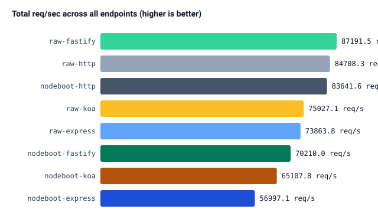
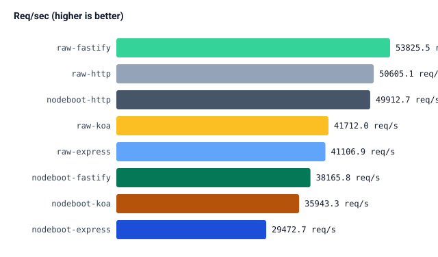
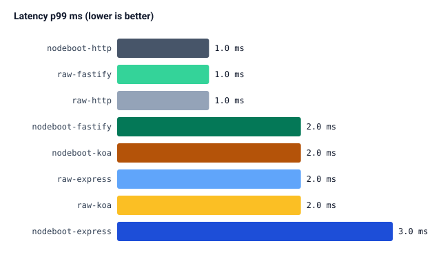
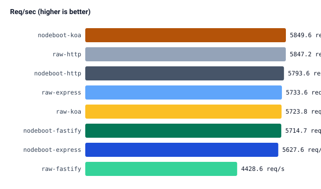
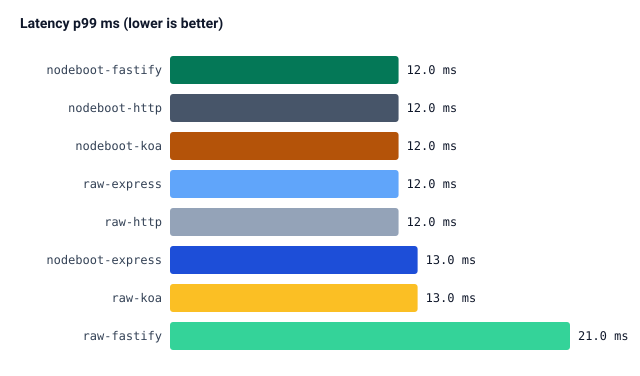
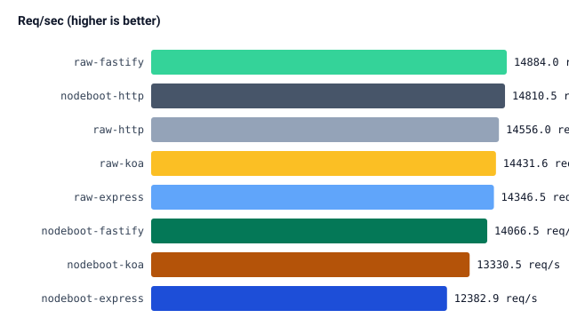
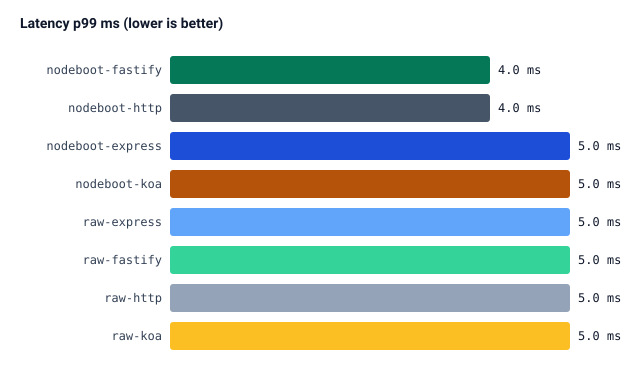
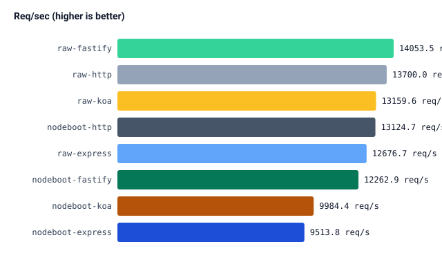
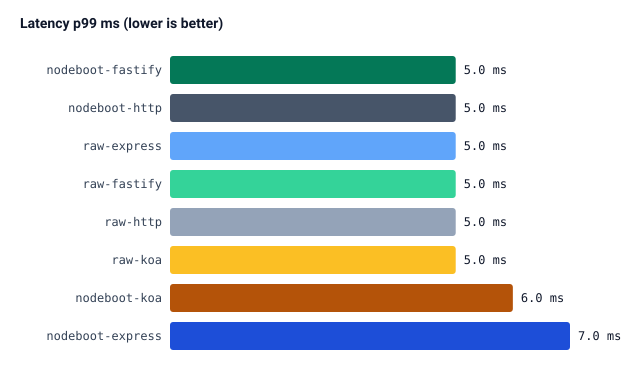

# Node-Boot Benchmarking Report

> Chart-enabled version of [REPORT.html](./REPORT.html) for the GitHub UI. See [REPORT.md](./REPORT.md) for a plain-text/table-only version.

Generated: 2026-08-12T13:29:45.544Z
Node-Boot version: `1.16.3`

## Benchmark setup

Service under test: a minimal REST API (native `http`/Express/Fastify/Koa, both a raw framework baseline and the equivalent Node-Boot app) exposing the 4 endpoints below, backed by a real **PostgreSQL** database via TypeORM (one dedicated database per app, seeded with 1,000 rows before each run — see `docker-compose.yaml` and `scripts/run-all.sh`).

**Endpoints under test:**

| Endpoint       | Method | Path       | Behaviour                                                                  |
| -------------- | ------ | ---------- | -------------------------------------------------------------------------- |
| `hello`        | GET    | `/hello`   | No DB access — pure framework/routing overhead                             |
| `todos-get`    | GET    | `/todos/1` | Single-row SELECT by primary key                                           |
| `todos-list`   | GET    | `/todos`   | List (SELECT ... LIMIT 20, ORDER BY id DESC) from a 1,000-row `todo` table |
| `todos-create` | POST   | `/todos`   | Single-row INSERT                                                          |

**Load test parameters** (via [autocannon](https://github.com/mcollina/autocannon)):

-   **50 concurrent connections**, **10s duration**, applied identically to every app/endpoint combination.
-   `todos-create` request body: `{"title":"Load test todo"}`
-   Each app is benchmarked **one at a time** (never concurrently with another app) so results aren't skewed by CPU/port contention between apps.

## Technical summary

Analysis computed directly from this run's data (not a fixed narrative) — each point is labeled ✅ Expected or ⚠️ Concerning based on whether it matches the pattern you'd expect from a routing/DI layer sitting on top of the same HTTP server and ORM calls.

-   ✅ **Expected**: Zero errors, timeouts, or non-2xx responses across all 8 apps and all 4 endpoints — every app handled the full load cleanly.
-   ✅ **Expected**: **express**: Node-Boot's throughput overhead shrinks from -28.3% on `hello` (routing/DI only) to -1.8% on `todos-create` (DB write). This is the expected pattern: Node-Boot's fixed per-request cost (decorators, DI resolution, interceptor pipeline) becomes proportionally smaller once real I/O (TypeORM + PostgreSQL) dominates total request time.
-   ✅ **Expected**: **fastify**: Node-Boot's throughput overhead shrinks from -29.1% on `hello` (routing/DI only) to 29.0% on `todos-create` (DB write). This is the expected pattern: Node-Boot's fixed per-request cost (decorators, DI resolution, interceptor pipeline) becomes proportionally smaller once real I/O (TypeORM + PostgreSQL) dominates total request time.
-   ✅ **Expected**: **http**: Node-Boot's throughput overhead shrinks from -1.4% on `hello` (routing/DI only) to -0.9% on `todos-create` (DB write). This is the expected pattern: Node-Boot's fixed per-request cost (decorators, DI resolution, interceptor pipeline) becomes proportionally smaller once real I/O (TypeORM + PostgreSQL) dominates total request time.
-   ✅ **Expected**: **koa**: Node-Boot's throughput overhead shrinks from -13.8% on `hello` (routing/DI only) to 2.2% on `todos-create` (DB write). This is the expected pattern: Node-Boot's fixed per-request cost (decorators, DI resolution, interceptor pipeline) becomes proportionally smaller once real I/O (TypeORM + PostgreSQL) dominates total request time.
-   ✅ **Expected**: **express**: relative p99 latency overhead shrinks (or stays flat) from +50.0% on `hello` to +8.3% on `todos-create`, mirroring the throughput trend — consistent with a fixed per-request routing/DI cost rather than one that scales with I/O work.
-   ✅ **Expected**: **fastify**: relative p99 latency overhead shrinks (or stays flat) from +100.0% on `hello` to +-42.9% on `todos-create`, mirroring the throughput trend — consistent with a fixed per-request routing/DI cost rather than one that scales with I/O work.
-   ✅ **Expected**: **http**: relative p99 latency overhead shrinks (or stays flat) from +0.0% on `hello` to +0.0% on `todos-create`, mirroring the throughput trend — consistent with a fixed per-request routing/DI cost rather than one that scales with I/O work.
-   ✅ **Expected**: **koa**: relative p99 latency overhead shrinks (or stays flat) from +0.0% on `hello` to +-7.7% on `todos-create`, mirroring the throughput trend — consistent with a fixed per-request routing/DI cost rather than one that scales with I/O work.
-   ✅ **Expected**: Averaged across all endpoints, **http** has the smallest Node-Boot overhead (-1.2%) and **express** the largest (-17.2%). Adapters with fewer built-in middleware layers (native `http`) or a leaner request lifecycle typically show less relative overhead than adapters with more middleware indirection (Express) — a ranking that flips between versions is worth investigating, a stable ranking is expected.
-   ✅ **Expected**: All frameworks stay under 50% average overhead, consistent with Node-Boot adding a routing/DI/decorator layer on top of the same underlying HTTP server and ORM, rather than duplicating work.
-   ℹ️ **Note**: This report reflects a single benchmark run on a shared development machine, not a dedicated/isolated benchmarking host. Absolute req/sec numbers will vary between machines; focus on the _relative_ raw-vs-nodeboot deltas and their trend across endpoints, and re-run multiple times before treating any single data point as conclusive.

## Overall summary

## Endpoint: `hello`

 

| App                | Req/sec | Latency p50 (ms) | Latency p99 (ms) | Errors |
| ------------------ | ------: | ---------------: | ---------------: | -----: |
| `nodeboot-express` | 29472.7 |              1.0 |              3.0 |      0 |
| `nodeboot-fastify` | 38165.8 |              1.0 |              2.0 |      0 |
| `nodeboot-http`    | 49912.7 |              0.0 |              1.0 |      0 |
| `nodeboot-koa`     | 35943.3 |              1.0 |              2.0 |      0 |
| `raw-express`      | 41106.9 |              1.0 |              2.0 |      0 |
| `raw-fastify`      | 53825.5 |              0.0 |              1.0 |      0 |
| `raw-http`         | 50605.1 |              0.0 |              1.0 |      0 |
| `raw-koa`          | 41712.0 |              1.0 |              2.0 |      0 |

**Node-Boot overhead vs raw framework:**

| Framework | Raw req/sec | Node-Boot req/sec | Throughput delta | Raw p99 (ms) | Node-Boot p99 (ms) |
| --------- | ----------: | ----------------: | ---------------: | -----------: | -----------------: |
| express   |     41106.9 |           29472.7 |           -28.3% |          2.0 |                3.0 |
| fastify   |     53825.5 |           38165.8 |           -29.1% |          1.0 |                2.0 |
| http      |     50605.1 |           49912.7 |            -1.4% |          1.0 |                1.0 |
| koa       |     41712.0 |           35943.3 |           -13.8% |          2.0 |                2.0 |

## Endpoint: `todos-create`

 

| App                | Req/sec | Latency p50 (ms) | Latency p99 (ms) | Errors |
| ------------------ | ------: | ---------------: | ---------------: | -----: |
| `nodeboot-express` |  5627.6 |              8.0 |             13.0 |      0 |
| `nodeboot-fastify` |  5714.7 |              8.0 |             12.0 |      0 |
| `nodeboot-http`    |  5793.6 |              8.0 |             12.0 |      0 |
| `nodeboot-koa`     |  5849.6 |              8.0 |             12.0 |      0 |
| `raw-express`      |  5733.6 |              8.0 |             12.0 |      0 |
| `raw-fastify`      |  4428.6 |             10.0 |             21.0 |      0 |
| `raw-http`         |  5847.2 |              8.0 |             12.0 |      0 |
| `raw-koa`          |  5723.8 |              8.0 |             13.0 |      0 |

**Node-Boot overhead vs raw framework:**

| Framework | Raw req/sec | Node-Boot req/sec | Throughput delta | Raw p99 (ms) | Node-Boot p99 (ms) |
| --------- | ----------: | ----------------: | ---------------: | -----------: | -----------------: |
| express   |      5733.6 |            5627.6 |            -1.8% |         12.0 |               13.0 |
| fastify   |      4428.6 |            5714.7 |            29.0% |         21.0 |               12.0 |
| http      |      5847.2 |            5793.6 |            -0.9% |         12.0 |               12.0 |
| koa       |      5723.8 |            5849.6 |             2.2% |         13.0 |               12.0 |

## Endpoint: `todos-get`

 

| App                | Req/sec | Latency p50 (ms) | Latency p99 (ms) | Errors |
| ------------------ | ------: | ---------------: | ---------------: | -----: |
| `nodeboot-express` | 12382.9 |              3.0 |              5.0 |      0 |
| `nodeboot-fastify` | 14066.5 |              3.0 |              4.0 |      0 |
| `nodeboot-http`    | 14810.5 |              3.0 |              4.0 |      0 |
| `nodeboot-koa`     | 13330.5 |              3.0 |              5.0 |      0 |
| `raw-express`      | 14346.5 |              3.0 |              5.0 |      0 |
| `raw-fastify`      | 14884.0 |              3.0 |              5.0 |      0 |
| `raw-http`         | 14556.0 |              3.0 |              5.0 |      0 |
| `raw-koa`          | 14431.6 |              3.0 |              5.0 |      0 |

**Node-Boot overhead vs raw framework:**

| Framework | Raw req/sec | Node-Boot req/sec | Throughput delta | Raw p99 (ms) | Node-Boot p99 (ms) |
| --------- | ----------: | ----------------: | ---------------: | -----------: | -----------------: |
| express   |     14346.5 |           12382.9 |           -13.7% |          5.0 |                5.0 |
| fastify   |     14884.0 |           14066.5 |            -5.5% |          5.0 |                4.0 |
| http      |     14556.0 |           14810.5 |             1.7% |          5.0 |                4.0 |
| koa       |     14431.6 |           13330.5 |            -7.6% |          5.0 |                5.0 |

## Endpoint: `todos-list`

 

| App                | Req/sec | Latency p50 (ms) | Latency p99 (ms) | Errors |
| ------------------ | ------: | ---------------: | ---------------: | -----: |
| `nodeboot-express` |  9513.8 |              5.0 |              7.0 |      0 |
| `nodeboot-fastify` | 12262.9 |              3.0 |              5.0 |      0 |
| `nodeboot-http`    | 13124.7 |              3.0 |              5.0 |      0 |
| `nodeboot-koa`     |  9984.4 |              4.0 |              6.0 |      0 |
| `raw-express`      | 12676.7 |              3.0 |              5.0 |      0 |
| `raw-fastify`      | 14053.5 |              3.0 |              5.0 |      0 |
| `raw-http`         | 13700.0 |              3.0 |              5.0 |      0 |
| `raw-koa`          | 13159.6 |              3.0 |              5.0 |      0 |

**Node-Boot overhead vs raw framework:**

| Framework | Raw req/sec | Node-Boot req/sec | Throughput delta | Raw p99 (ms) | Node-Boot p99 (ms) |
| --------- | ----------: | ----------------: | ---------------: | -----------: | -----------------: |
| express   |     12676.7 |            9513.8 |           -25.0% |          5.0 |                7.0 |
| fastify   |     14053.5 |           12262.9 |           -12.7% |          5.0 |                5.0 |
| http      |     13700.0 |           13124.7 |            -4.2% |          5.0 |                5.0 |
| koa       |     13159.6 |            9984.4 |           -24.1% |          5.0 |                6.0 |
